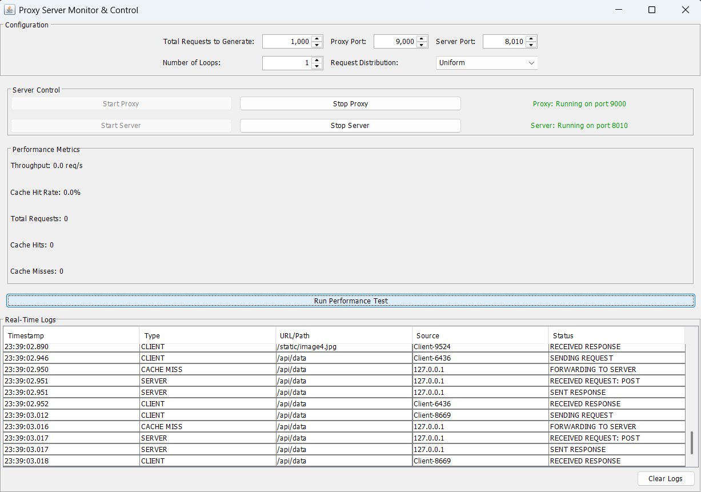

# 🌐 Multi Threaded Web Server

A Java-based multi-threaded proxy web server with a graphical user interface. It accepts HTTP requests from clients, forwards them to target servers, and sends back the response—all while supporting concurrent client connections through multithreading.

---

## 🚀 Features

- Multi-threaded server handling concurrent clients
- Basic caching mechanism (if supported in implementation)
- GUI to control the proxy server
- Real-time logs of request and response handling
- Modular design with separate classes for UI, client, server, and proxy logic

---

## 🧠 How It Works

- `Server.java`: Initializes the main server socket and listens for incoming client connections.
- `Client.java`: Represents a client handler that communicates with the requested web server and returns data to the browser.
- `ProxyServer.java`: Manages connections and logging, interfaces between server and UI.
- `ProxyServerUI.java`: A Swing-based interface to start/stop the server, display logs, and control server behavior.

Each client is handled in a separate thread, enabling simultaneous processing of multiple requests.

---

## 🖥️ Running the Project

### 🛠 Requirements

- Java JDK 8 or later
- IDE like IntelliJ IDEA or Eclipse (or run from terminal)

### ▶️ Steps to Run

```bash
# Step 1: Navigate to the source directory
cd multithreaded-web-server

# Step 2: Compile the Java files
javac *.java

# Step 3: Run the Proxy Server UI
java ProxyServerUI
```

You should see a GUI pop up allowing you to start the proxy server.

---

## 📸 UI Snapshot



---

## 📁 Project Structure

```
multithreaded-web-server/
│
├── Client.java           # Handles client-server communication
├── ProxyServer.java      # Core logic for request/response handling
├── ProxyServerUI.java    # Swing GUI for controlling the server
└── Server.java           # Listens for client connections
```

---

## 🤝 Contributing

Contributions are welcome! If you have improvements or bug fixes, feel free to fork the repo and open a pull request.

---

## 📜 License

This project is licensed under the MIT License.
